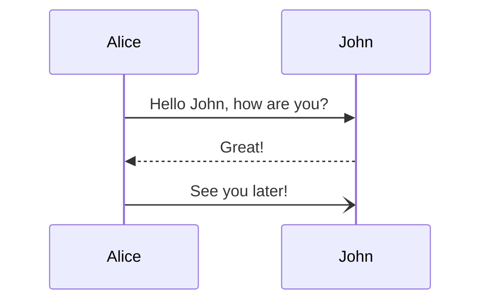
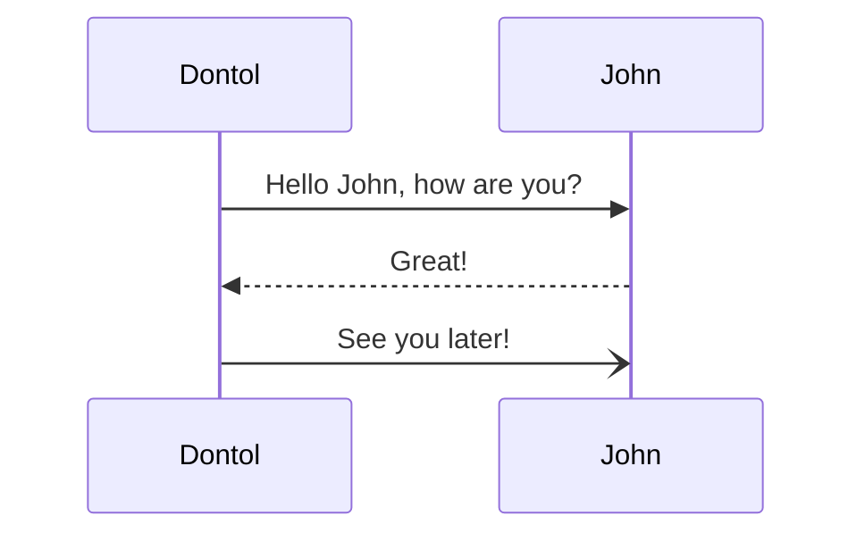

# Hello Unity


# Generator Taksonomi untuk Blog

Script ini berfungsi untuk menghasilkan sistem taksonomi (pengkategorian) konten blog dengan menganalisis file markdown dan metadata frontmatter-nya.

## Cara Kerja

Script ini memproses file markdown untuk membuat sistem taksonomi terstruktur yang mengorganisir konten berdasarkan seri dan tag. Hasilnya disimpan sebagai `taxonomies.json`.

### Komponen Utama

1. **GenerateTaxonomiesJSON**: Fungsi utama yang mengatur proses pembuatan taksonomi
2. **GetListFrontmatterData**: Membaca dan mengekstrak frontmatter dari file markdown
3. **CreateTaxonomiesData**: Memproses data frontmatter menjadi struktur taksonomi
4. **pathToSlug**: Mengubah path file menjadi URL yang mudah dibaca

### Struktur yang Dihasilkan

```json
{
  "series": {
    "namaSeri": ["url1", "url2"]
  },
  "tags": {
    "namaTag": ["url1", "url2"]
  },
  "items": {
    "url": {
      "lang": "string",
      "title": "string",
      "description": "string",
      "series": "string",
      "tags": ["string"],
      // ...metadata lainnya
    }
  }
}
```

```json
{
  "series": {
    "namaSeri": ["url1", "url2"]
  },
  "tags": {
    "namaTag": ["url1", "url2"]
  },
  "items": {
    "url": {
      "lang": "string",
      "title": "string",
      "description": "string",
      "series": "string",
      "tags": ["string"],
      // ...metadata lainnya
    }
  }
}
```

## Alur Proses





## Cara Penggunaan

```js
import { GenerateTaxonomiesJSON } from './taxonomies'

// Generate taksonomi dengan direktori default
GenerateTaxonomiesJSON()

// Atau tentukan direktori kustom
GenerateTaxonomiesJSON('./direktori/output/kustom')
```
